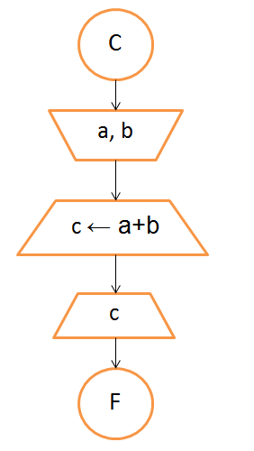

# Adición
**Problema:** Escribir los pasos para mostrar la suma de dos números ingresados por el usuario.

**Análisis:**
- Ingresan dos números, a y b;
- se suman estos números entre sí;
- sale c, que es otro número, resultado de la suma de a y b.

**Léxico:**
a,b ∈ ℤ

**Algoritmo:**
- Leer a
- Leer b
- Escribir a+b

